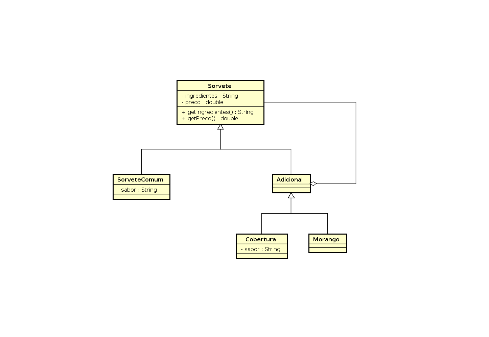

# Decorator Design Pattern

No [final desta página](#exemplo) existe um exemplo do problema que o padrão decorator resolve.

## Diagrama



## Implementação

Interface principal que possui os métodos que serão utilizados

```Java
public interface Sorvete {

    public String getIngredientes();

    public double getPreco();
}
```

Sorvete de uma bola é uma implementação concreta da interface sorvete
que é usada para conter os parametros base.

Os objetos dessa classe poderão ser incrementados posteriormente com os
objetos que extendem `Adicional`. ex.: `Cobertura`, `Morango`

```Java
public class SorveteUmaBola implements Sorvete {

    private String sabor;

    public SorveteUmaBola(String sabor) {
        this.sabor = sabor;
    }

    @Override
    public String getIngredientes() {
        return "Sorvete de uma bola de " + this.sabor;
    }

    @Override
    public double getPreco() {
        return 5.0;
    }
}
```

A classe `Adicional` é uma classe abstrata que serve de base pra
todo o conceito do padrão decorator. Ela contém dentro de sí um objeto
do tipo `Sorvete` e implementa a interface `Sorvete`. Assim toda classe que
extende `Adicional` possui um `Sorvete` e é um `Sorvete`, isso permite
que se adicione funcionalidades dinamicamente à objetos do tipo `Sorvete`.

```Java
public abstract class Adicional implements Sorvete {
    private Sorvete sorvete;

    public Adicional(Sorvete sorvete) {
        this.sorvete = sorvete;
    }

    @Override
    public String getIngredientes() {
        return sorvete.getIngredientes();
    }

    @Override
    public double getPreco() {
        return sorvete.getPreco();
    }
}
```

A classe `Cobertura` extende a classe `Adicional` e quando utilizada junto com
um objeto do tipo `Sorvete` ela adiciona novas propriedades ao objeto.

Nesse caso ela adiciona R$ 0,70 ao preço, e uma cobertura de `sabor` ao sorvete.

```Java
public class Cobertura extends Adicional {

    private String sabor;

    public Cobertura(Sorvete sorvete, String sabor) {
        super(sorvete);
        this.sabor = sabor;
    }

    @Override
    public String getIngredientes() {
        return super.getIngredientes() + " e com cobertura de " + this.sabor;
    }

    @Override
    public double getPreco() {
        return super.getPreco() + 0.7;
    }
}
```
```Java
public class Morango extends Adicional {

    public Morango(Sorvete sorvete) {
        super(sorvete);
    }

    @Override
    public String getIngredientes() {
        return super.getIngredientes() + " e com morango";
    }

    @Override
    public double getPreco() {
        return super.getPreco() + 1.5;
    }
}
```

Exemplo de uso:

```Java
public class App {
    public static void main(String[] args) throws Exception {
        Sorvete meuSorvete = new SorveteDuasBolas("chocolate");
        meuSorvete = new Cobertura(meuSorvete, "uva");
        meuSorvete = new Cobertura(meuSorvete, "banana");
        meuSorvete = new Morango(meuSorvete);

        // Ingredientes: Sorvete de uma bola de chocolate e com cobertura de uva e com cobertura de banana e com morango
        System.out.println("Ingredientes: " + meuSorvete.getIngredientes());
        // Preço: 7.9
        System.out.println("Preço: " + meuSorvete.getPreco());
    }
}
```

## Exemplo

Considerando a mesma funcionalidade feita utilizando somente classes e herança:

```Java
class Sorvete {
    private String sabor;

    public Sorvete(String sabor) {
        this.sabor = sabor;
    }

    public String getIngredientes() {
        return "Sorvete de uma bola sabor " + this.sabor;
    }

    public double getPreco() {
        return 5;
    }
}

class SorveteComCobertura extends Sorvete {
    // Possui própria implementação de getIngredientes() e getPreco()
}

class SorveteComCoberturaEMorango extends Sorvete {
    // Possui própria implementação de getIngredientes() e getPreco()
}

class SorveteDuasBolas extends Sorvete {
    // Possui própria implementação de getIngredientes() e getPreco()
}

class SorveteDuasBolasComCobertura extends Sorvete {
    // Possui própria implementação de getIngredientes() e getPreco()
}

class SorveteDuasBolasComCoberturaEMorango extends Sorvete {
    // Possui própria implementação de getIngredientes() e getPreco()
}

class SorveteDuasBolasComDuasCoberturas extends Sorvete {
    // Possui própria implementação de getIngredientes() e getPreco()
}
```
